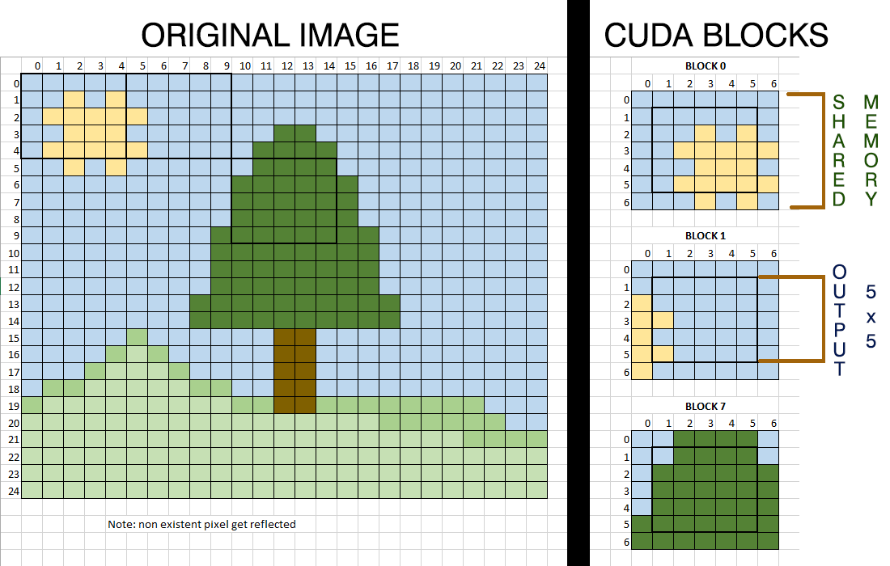

# Bilateral Filter

CUDA implementation of [Bilateral Filter](https://en.wikipedia.org/wiki/Bilateral_filter)

## Dependecies

- Cuda
- OpenCV
- OpenMP

## Settings

- Set CMAKE_CUDA_ARCHITECTURES in cmake/GPUConfig.cmake according to your device compute capability.
- Set SPEEDUP_PARALLEL to 1 in src/main.cpp to print the speedup of the CUDA parallel solution in relation with the others.
- Set USE_PARALLEL_NAIVE to 1 in src/main.cpp to use the naive (slow) CUDA version (not recommended).

## Run

```
mkdir build && cd build
cmake ..
make -j8
./bilateral_filter
```

## Implementation details

### Sequential

The sequential version has been provided by Mirco De Marchi, and it's the starting point from the other implementations.

### OpenMP

There were several points were it could've made sense to apply OpenMP directives.

1. During the color weight initialization step
2. During the gaussian space generation step
3. During the filtering step

After various benchmarks it turned out that it wasn't worth using OpenMP in the first 2 cases, as the loops were small enough that the overhead outweighted the benefits compared to a purely sequential approach.  
So it was only applied to the third step, using a simple `#pragma omp parallel for` on the outer `for` loop.

### CUDA Naive

This was the first version made. Basically it parallelized the filtering step by creating a thread for each pixel (in blocks of 1024), each thread accessing the same global memory data.
Even if GPUs have memory coalescing, it turned out to be not that much efficient as it had many global memory accesses (which are slow).

The occupancy was 100%

### CUDA (Shared)

This second version uses shared memory and turned out to be quite fast, even if the occupancy is less than 100%.  

The general idea is dividing the image in `K-squares NxN` and then create `K-CUDA` blocks which are composed of `(N+2*radius)x(N+2*radius)` threads.  
Each thread in a block will load data (mainly pixels) in a shared memory chunk. Then only the most internal threads of the block will be used to actually calculate the new pixel values.

The following picture simulates the block division by using a 25*25 image using 5x5 squares with a radius parameter of 1.

</img>

The size of the CUDA blocks are calculated in an automatic way. In most GPUs they'll be composed of 1024 threads (32x32).  
Considering the previous formula, it means that to not waste too much resources one should avoid to have a big radius as parameter.

In the benchmarks it was chosen a radius of 4 pixels, which means that for every CUDA block we were only calculating ((32-8) x (32-8)) effective pixel values = 576 pixels.  
This means that **only `56.25%` of the threads in a CUDA block actually contributed to the final result**, while the other 43.75% were only used to load resources from the global memory to the shared memory.

## Benchmark Results

This filter has been tried on 3 different devices.

| ID | CPU          | GPU             |
|----|--------------|-----------------|
| A  | AMD FX-6350  | NVIDIA 1060 GTX |
| B  | AMD R5-5600X | NVIDIA 3090 RTX |
| C  | ????         | ?????           |

On every computer this implementation of the Bilateral Filter turned out to be comparable with OpenCV's (when both ran in parallel mode).

### cones.png (2'435'860 pixels)

| ID | CPU Seq | CPU OMP      | CPU OpenCV        |  CUDA    | CUDA OpenCV     |
|----|---------|--------------|-------------------|----------|-----------------|
| A  | 352 ms  | 84 ms        | 91 ms             |  23 ms   |  26 ms          |
| B  | 121 ms  | 15 ms        | 13 ms             |  8 ms    |  7 ms           |
| C  | ??????? | ????         | ?????             |          |                 |

### lenna.jpeg (361'200 pixels)

| ID | CPU Seq | CPU OMP      | CPU OpenCV        |  CUDA    | CUDA OpenCV     |
|----|---------|--------------|-------------------|----------|-----------------|
| A  | 50 ms   | 14 ms        | 17 ms             |  5 ms    |  5 ms           |
| B  | 18 ms   | 9 ms         | 7 ms              |  1 ms    |  1 ms           |
| C  | ??????? | ????         | ?????             |          |                 |

### meadows.png (99'300 pixels)

| ID | CPU Seq | CPU OMP      | CPU OpenCV        |  CUDA    | CUDA OpenCV     |
|----|---------|--------------|-------------------|----------|-----------------|
| A  | 16 ms   | 6 ms         | 7 ms              |  3 ms    |  3 ms           |
| B  | 5 ms    | 2 ms         | 3 ms              |  1 ms    |  1 ms           |
| C  | ??????? | ????         | ?????             |          |                 |

### mountain.jpg (114'072 pixels)

| ID | CPU Seq | CPU OMP      | CPU OpenCV        |  CUDA    | CUDA OpenCV     |
|----|---------|--------------|-------------------|----------|-----------------|
| A  | 21 ms   | 4 ms         | 5 ms              |  3 ms    |  3 ms           |
| B  | 6 ms    | 2 ms         | 4 ms              |  1 ms    |  1 ms           |
| C  | ??????? | ????         | ?????             |          |                 |

### noir.png (111'000 pixels)

| ID | CPU Seq | CPU OMP      | CPU OpenCV        |  CUDA    | CUDA OpenCV     |
|----|---------|--------------|-------------------|----------|-----------------|
| A  | 19 ms   | 4 ms         | 4 ms              |  3 ms    |  4 ms           |
| B  | 5 ms    | 2 ms         | 1 ms              |  1 ms    |  1 ms           |
| C  | ??????? | ????         | ?????             |          |                 |

### rosso.png (144'000 pixels)

| ID | CPU Seq | CPU OMP      | CPU OpenCV        |  CUDA    | CUDA OpenCV     |
|----|---------|--------------|-------------------|----------|-----------------|
| A  | 25 ms   | 6 ms         | 7 ms              |  3 ms    |  3 ms           |
| B  | 7 ms    | 2 ms         | 3 ms              |  1 ms    |  2 ms           |
| C  | ??????? | ????         | ?????             |          |                 |

### rubik.png (230'337 pixels)

| ID | CPU Seq | CPU OMP      | CPU OpenCV        |  CUDA    | CUDA OpenCV     |
|----|---------|--------------|-------------------|----------|-----------------|
| A  | 39 ms   | 10 ms        | 8 ms              |  4 ms    |  3 ms           |
| B  | 13 ms   | 2 ms         | 5 ms              |  2 ms    |  2 ms           |
| C  | ??????? | ????         | ?????             |          |                 |

### sky.png (132'300 pixels)

| ID | CPU Seq | CPU OMP      | CPU OpenCV        |  CUDA    | CUDA OpenCV     |
|----|---------|--------------|-------------------|----------|-----------------|
| A  | 23 ms   | 5 ms         | 7 ms              |  3 ms    |  3 ms           |
| B  | 7 ms    | 2 ms         | 3 ms              |  2 ms    |  1 ms           |
| C  | ??????? | ????         | ?????             |          |                 |

As expected, the parallel versions performed better than the sequential version.  
And the GPU versions performed better than the CPU (parallel) ones. The speedup gets more noticeable with bigger images.

## Naive CUDA version

The Naive CUDA version performs quite bad. It's slower than all other parallel versions and about as fast as the Sequential version.


## Notes

Beware that sometimes the first images processed, regardless of the image, has distorted timings due to, probably, some kind of hidden CUDA startup.  
To get valuable results (for both OpenCV and this implementation) it's advisable to run the benchmark multiple times while also changing the order of the pictures.
